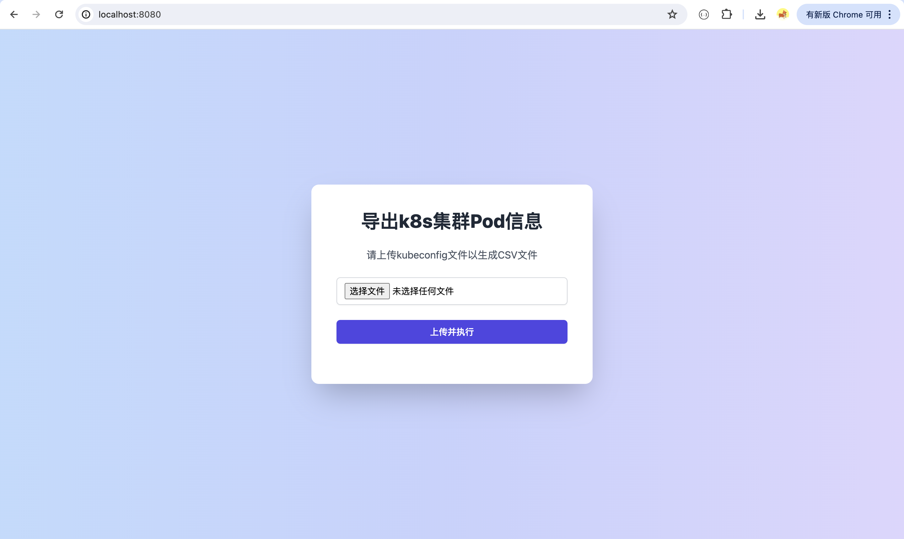

# k8s-pod-info-exporter

`k8s-pod-info-exporter` 是一个用于通过 `kubeconfig` 文件调用 K8s API 导出 Kubernetes Pod 信息的工具，并通过一个简单的 Web 界面提供文件上传和下载功能。

## 功能

- 上传 kubeconfig 文件
- 生成 Kubernetes Pod 信息的 CSV 文件
- 下载生成的 CSV 文件

## 快速开始

### 使用二进制

> 不使用web界面

MAC M1

```sh
wget https://gitlab.com/baimiyishu13/k8s-resourc-exporter/-/jobs/7413197877/artifacts/raw/k8s-resource-exporter-mac.tar.gz
```

Linux amd64

```sh
wget https://gitlab.com/baimiyishu13/k8s-resourc-exporter/-/jobs/7413197877/artifacts/raw/k8s-resource-exporter-adm64.tar.gz
```

**减压后执行二进制文件：**

```sh
➜  bin git:(main) ✗ ./k8s-resource-exporter-mac 
Usage: ./k8s-resource-exporter-mac --config /path/to/kubeconfig [--output /path/to/output]
  -config string
        Path to the kubeconfig file
  -output string
        Path to the output directory (default ".")
2024/07/25 10:43:25 Error: kubeconfig path is required. Use --config to specify the path or -h to see the help message.
```

示例：

```sh
./k8s-resource-exporter-mac ---config kubeconfig
```


### 使用 Docker

```sh
docker run -d --name  k8s-pod-info-exporter  -p 8080:8080 registry.gitlab.com/devops-paddle/k8s-pod-info-exporter/k8s-pod-info-exporter:main
```

访问：localhost:8080


